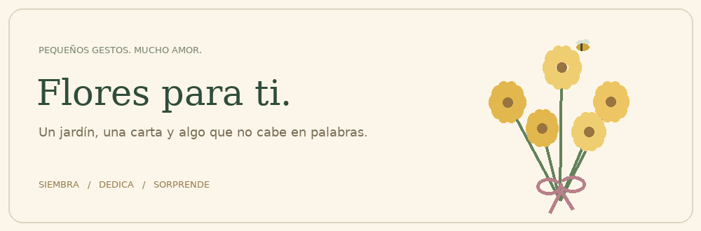
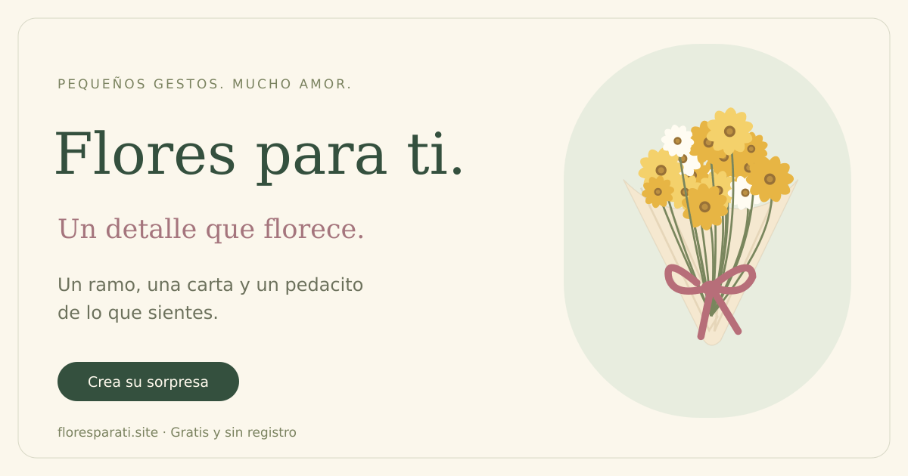

<div align="center">

<picture>
  <source media="(prefers-reduced-motion: reduce)" srcset=".github/assets/garden.png">
  
</picture>

# Flores Amarillas · Flores para ti

**Un jardín, una carta y algo que no cabe en palabras.**

Crea un regalo virtual con flores amarillas, tus recuerdos y tu voz. Sin registro.

[**Abrir el jardín**](https://floresparati.site/) · [Cómo funciona](#un-regalo-en-tres-pasos) · [Desarrollo](#ejecutarlo-en-local) · [Equipo](#hecho-por)

</div>

---

## Un regalo en tres pasos

| 01 · Piensa en alguien | 02 · Dale tu toque | 03 · Hazle sonreír |
| --- | --- | --- |
| Escribe su nombre y el motivo de tu regalo. | Prepara su ramo, escribe una carta y añade tus recuerdos. | Comparte el enlace por WhatsApp o donde prefieras. |

## Lo que guarda este jardín

- **Un mundo en 3D.** Flores que crecen, abejas, mariposas y dos ambientes: tarde de sol o noche con luciérnagas.
- **Una carta que se siente tuya.** Papel, cinta, firma y pequeñas razones escondidas en las flores.
- **Fotos, dibujos y voz.** Hasta tres fotos, dibujos propios y una nota de voz de hasta 30 segundos.
- **Ayuda para encontrar las palabras.** Un asistente propone opciones que puedes editar antes de aplicarlas.
- **Cariño de vuelta.** Quien recibe puede responder desde el enlace; las respuestas quedan junto a la carta.
- **Un recuerdo para guardar.** Descarga una postal con la carta, dibujos y fotos.
- **Pensado para móviles.** Calidad adaptativa, controles SVG, movimiento reducido y música que se pausa al salir de la página.

## Una invitación para compartir



La portada tiene su propia imagen para redes. Los regalos generan una tarjeta personalizada con el nombre y el ramo: **el texto de la carta, las fotos y la voz no se incluyen en la vista previa**. Quien tenga el enlace puede abrir el regalo; los regalos no forman parte del sitemap y llevan `noindex`.

## Hecho por

| [Eduardo Lucas · @lucsducks](https://github.com/lucsducks) | [Afkaqui · @Afkaqui](https://github.com/Afkaqui) |
| :---: | :---: |
| Desarrollo del proyecto | Desarrollo del proyecto |

Si este jardín te sacó una sonrisa, puedes apoyarlo con una **Star** en la parte superior de [este repositorio](https://github.com/Afkaqui/flores_amarillas). También puedes [reportar un problema o proponer una idea](https://github.com/Afkaqui/flores_amarillas/issues).

## Construido con

| Experiencia | Servidor | Datos e infraestructura |
| --- | --- | --- |
| JavaScript, Three.js, anime.js y CSS | Node.js, Express, Sharp y FFmpeg | PostgreSQL y Docker |

El frontend usa módulos del navegador e importmap; no necesita un paso de compilación. Las claves y el acceso al asistente permanecen en el servidor.

La guía de escritura del asistente está en `server/letter-style.js`: conserva la intención de quien escribe, propone cartas con voces distintas y pide detalles reales para personalizarlas. Sus criterios editoriales toman como referencia [Humanizer](https://github.com/blader/humanizer/blob/main/SKILL.md) y la [guía de cartas de amor de Hallmark](https://ideas.hallmark.com/articles/valentines-day-ideas/how-to-write-a-love-letter/).

## Ejecutarlo en local

Requiere Node.js 20 o superior, PostgreSQL y FFmpeg para las notas de voz.

```sh
npm ci --prefix server
cp .env.example .env
```

Configura `DATABASE_URL` en tu archivo local. Después:

```sh
node server/scripts/setup-metrics.mjs .env
npm --prefix server run prepare:public
node --env-file=.env server/index.js
```

Abre `http://localhost:3000`. El servidor prepara las tablas al arrancar. El asistente necesita `OPENCODE_GO_API_KEY`; el jardín y las cartas funcionan sin esa clave. El panel privado está en `/metrics` y usa la clave generada por el script de configuración. No incluyas `.env` en el repositorio.

<details>
<summary><strong>Pruebas y estructura</strong></summary>

```sh
node --test tests/*.test.mjs
```

Las pruebas de PostgreSQL y API se omiten sin `FLORES_TEST_DB=1`. Para ejecutarlas, configura una base de pruebas independiente.

| Carpeta | Contenido |
| --- | --- |
| `js/` | Jardín, creador, carta y controles |
| `css/` | Estilos y diseño adaptable |
| `shared/` | Validación, dibujos e ilustraciones compartidas |
| `server/` | API, archivos, asistente y métricas |
| `tests/` | Pruebas de comportamiento y seguridad |
| `.github/assets/` | Imágenes de este README |

</details>

<details>
<summary><strong>Desplegar con Docker</strong></summary>

```sh
docker build -t flores-amarillas .
docker run --env-file .env -e MEDIA_ROOT=/app/media \
  -p 127.0.0.1:3000:3000 -v flores-media:/app/media flores-amarillas
```

La base de datos debe ser accesible desde el contenedor. Configura `ORIGEN` con la URL HTTPS pública y utiliza un proxy HTTPS. Conserva y respalda PostgreSQL y el volumen de archivos. Las configuraciones de cada servidor se mantienen fuera de este repositorio.

</details>

<details>
<summary><strong>SEO, privacidad y vistas previas</strong></summary>

La portada tiene metadatos Open Graph, Twitter y datos estructurados. `/sitemap.xml` incluye sólo la portada; `/robots.txt` anuncia ese sitemap. Las cartas y el panel privado llevan `noindex`. Las cartas se pueden abrir por su enlace, por lo que no deben tratarse como mensajes con acceso restringido.

El panel privado `/metrics` sirve para **monitorear el funcionamiento y el consumo del servicio**: volumen de peticiones, tráfico, tiempos de respuesta, errores y tokens del asistente. También incluye conteos de uso, como visitas y regalos creados, para dimensionar la capacidad del servidor. Estas métricas no guardan el contenido de cartas, fotos ni conversaciones. Para estimar navegadores por día se usa una cookie de 24 horas; sus identificadores diarios se conservan 30 días y los totales, 365. El panel requiere clave y no se enlaza desde la portada.

Si cambias `OPENCODE_GO_API_KEY`, recrea el contenedor para que tome el nuevo entorno (`docker compose up -d --force-recreate --no-deps flores-amarillas` si usas Compose con ese nombre de servicio). Un reinicio del contenedor existente conserva su entorno anterior. Los fallos del asistente se muestran dentro del creador con opciones para reintentar o seguir escribiendo; el servidor registra únicamente el tipo de fallo y el estado HTTP del proveedor, sin claves ni contenido de las peticiones.

</details>

---

<div align="center">

**Pequeños gestos. Mucho amor.**

[Prepara unas flores para alguien especial](https://floresparati.site/)

</div>
